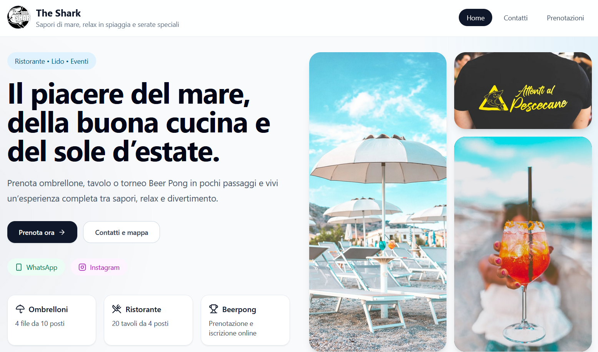
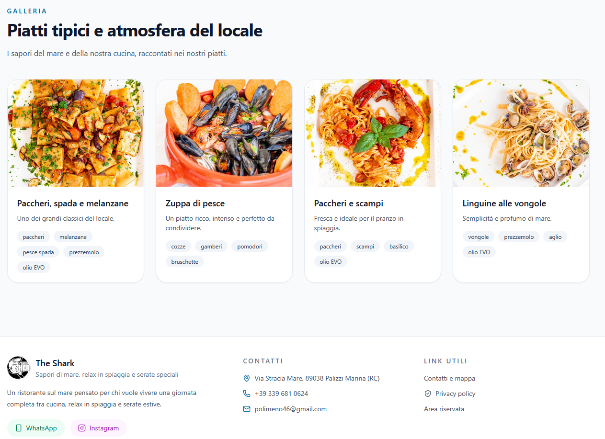

# 🍽️ The Shark – Sistema Web per Ristoranti

Benvenuto in **The Shark Web App**, una piattaforma pensata per la gestione moderna di ristoranti e locali.

 ## 📸 Homepage

  
  


Questo progetto nasce con l’obiettivo di digitalizzare e semplificare:
- Prenotazioni tavoli
- Gestione eventi (es. Beer Pong)
- Interazione cliente–locale
- Esperienza utente tramite interfaccia moderna

---

## 🚀 Funzionalità principali

✔️ Prenotazione tavoli online  
✔️ Prenotazione ombrelloni (se applicabile)  
✔️ Gestione tornei Beer Pong con:
- Generazione automatica tabellone
- Visualizzazione grafica
- Selezione vincitori

✔️ Interfaccia responsive (mobile-friendly)  
✔️ UI moderna e personalizzabile  
✔️ Integrazione futura con sistemi di pagamento online  

---

## 🧩 Tecnologie utilizzate

- HTML / CSS / JavaScript
- (Opzionale) Backend con Supabase
- Hosting: Vercel (consigliato)
- Database: Supabase / PostgreSQL

---

## 📦 Installazione e utilizzo in locale

### 1. Clona il repository

```bash
git clone https://github.com/tuo-username/nome-repo.git
cd nome-repo
```

---

### 2. Avvia il progetto in locale

Hai diverse opzioni:

#### 🔹 Metodo semplice (visualizzazione base)

Dal terminale di Visual Studio Code

```bash
npm install
npm run dev
```
---

#### 🔹 Metodo con server locale (consigliato per sviluppo)

Se hai Node.js installato:

```bash
npx serve
```

oppure con Python:

```bash
python -m http.server 8080
```

Poi apri nel browser:

```
http://localhost:8080
```

---

## ⚙️ Configurazione (se utilizzi Supabase)

Se il progetto utilizza Supabase:

1. Crea un progetto su Supabase
2. Inserisci le chiavi API nel file di configurazione (es. `config.js`)
3. Configura le tabelle necessarie:
   - prenotazioni
   - eventi
   - partecipanti

---

## 🌐 Deploy online

Il progetto può essere facilmente pubblicato con:

### 🔹 Vercel (consigliato)

1. Vai su https://vercel.com  
2. Collega il repository GitHub  
3. Deploy automatico 🚀  

---

## 💡 Integrazione con sistemi esterni (TheFork)

Questo sistema può essere utilizzato in due modi:

- **Standalone** → gestisci tutto dal tuo sito
- **Integrato con TheFork** → reindirizzamento o sincronizzazione

👉 Consiglio:
Se usi già TheFork per la gestione fiscale, puoi:
- mantenere TheFork come backend prenotazioni
- usare questo sito come frontend personalizzato

---

## 📌 Note importanti

- Il sistema è altamente personalizzabile
- Può essere adattato a qualsiasi ristorante o locale
- È pensato per essere espandibile (pagamenti, notifiche, ecc.)
  
Environment Variables:
Nel codice del sito, vengono inizializzate diverse variabili che trovi nel file .env.example. Queste includono chiavi personali di accesso alle API supabase, email personale con la quale inviare conferma di prenotazione ai clienti, variabili credenziali PayPal API per registrare i pagamenti sul proprio account personale.

---

## 📄 Licenza

Questo progetto è open-source e può essere modificato liberamente.

---
